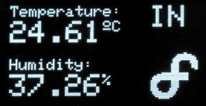
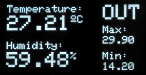
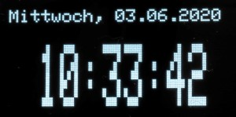

# InfoScreen

Arduino subscribes values by MQTT and view info on an OLED I2C display


<!-- TOC -->

- [InfoScreen](#infoscreen)
    - [FEATURES](#features)
    - [IMAGES](#images)
    - [REQUIREMENTS](#requirements)
    - [INSTALL AND USAGE](#install-and-usage)
        - [PINOUT](#pinout)
        - [LIBRARIES ###](#libraries-)
        - [DISPLAY REFERENCE](#display-reference)
    - [DIRECTORIES AND FILES](#directories-and-files)
    - [CREATE BITMAPS](#create-bitmaps)
        - [ONLINE](#online)
        - [OFFLINE](#offline)
    - [TROUBLESHOOTING](#troubleshooting)
    - [LICENSE](#license)

<!-- /TOC -->

## FEATURES

- Connects to the Wireless Access Pointt / Wifi Router
- Securely connects to the MQTT Broker (TLS)
- Subscribes to the desired MQTT topics
- Handles incoming MQTT messages
- Controls ESP8266 Chip Level Data Pins
- Sends a heartbeat signal to the MQTT broker periodically
- Receive MQTT Data of barometric weather data from outdoor weather station
- Measuring of indoor temperature, humidity, air pressure with BME280 sensor
- Display all data on an 128 x 64 Pixel 0,96 Zoll OLED I2C Display

## IMAGES





## REQUIREMENTS

- Wemos D1 Mini (should work with other Arduino microcontrollers too)
- PlatformIO or Arduino IDE (for Arduino IDE you have to move files from /src to root-folder)
- MQTT Broker such as the Mosquitto MQTT Broker (https://mosquitto.org/)
- ControllApp such as MQTT Dash (https://play.google.com/store/apps/details?id=net.routix.mqttdash&hl=en)
- 128 x 64 Pixel 0,96 Zoll OLED I2C Display 
    - https://www.amazon.de/AZDelivery-Display-Arduino-Raspberry-gratis/dp/B074N9VLZX/ | 5,99 €

## INSTALL AND USAGE

### PINOUT

| Sensor-Description | Sensor-PIN | Arduino D1 Mini | Comment |
| --- | --- | --- | --- |
| 128 x 64 Pixel 0,96 Zoll OLED I2C Display	| Vcc | 5V | - |
| 128 x 64 Pixel 0,96 Zoll OLED I2C Display	| Gnd | Gnd | - |
| 128 x 64 Pixel 0,96 Zoll OLED I2C Display	| SDA | D2 | GPIO4 |
| 128 x 64 Pixel 0,96 Zoll OLED I2C Display	| SCK | D1 | GPIO5 |
| GY-BME280 Barometric sensor | Vcc | 3V | - |
| GY-BME280 Barometric sensor | Gnd | Gnd | - |
| GY-BME280 Barometric sensor | SDA | D2 | GPIO4 |
| GY-BME280 Barometric sensor | SCK | D1 | GPIO5 |

### LIBRARIES ###

- PubSubClient by Nick O'Leary | A client library for MQTT messaging. MQTT is a lightweight messaging protocol ideal for small devices
- esp8266_mdns by dunk | mDNS queries and responses on esp8266. Or to describe it another way: An mDNS Client or Bonjour Client library for the esp8266.
- Adafruit GFX Library by Adafruit | Adafruit GFX graphics core library, this is the 'core' class that all our other graphics libraries derive from.
- Adafruit SSD1306 by Adafruit | SSD1306 oled driver library for monochrome 128x64 and 128x32 displays
- Adafruit BME280 Library by Adafruit | Arduino library for BME280 sensors.

### DISPLAY REFERENCE

```
display.clearDisplay() – all pixels  off
display.drawPixel(x,y, color) – plot a pixel in x,y coordinate
display.setTextSize(n) – set font size (1-8)
display.setCursor(x,y) – set coordinates start writing text
display.print(“message”) – print the characters at location x,y set in above
display.display() – call to make effect
```

## DIRECTORIES AND FILES

- src/infoscreen.ino - The main programm code
- src/config.h - GPIO configuration, definition of threshold values, etc.
- src/credentials.h.sample - Sample configuration file for WiFi and MQTT credentials (please rename to secrets.h)
- README.md - The manual for this Arduino Script
- LICENSE - The license notes for this Arduino script
- platformio.ini - Wemos D1 Mini Configuration for PlatformIO

## CREATE BITMAPS

### ONLINE

http://javl.github.io/image2cpp/

### OFFLINE

You can create bitmaps to display easily with the LCD assistant software. First make your image using any kind of graphics software such as photoshop or Paint and save as a **Monochrome Bitmap (bmp)**. Save the **output of LCD assistant to a cpp file**.

Download: http://en.radzio.dxp.pl/bitmap_converter/

## TROUBLESHOOTING

Wrong I2C address
Make sure you check your display I2C address using an I2C scanner sketch. Put it into config.h 

SDA and SCL not connected properly
Please make sure that you have the SDA and SCL pins of the OLED display wired correctly.

## LICENSE

InfoScreen and all individual scripts are under the BSD 3-Clause license unless explicitly noted otherwise. Please refer to the LICENSE